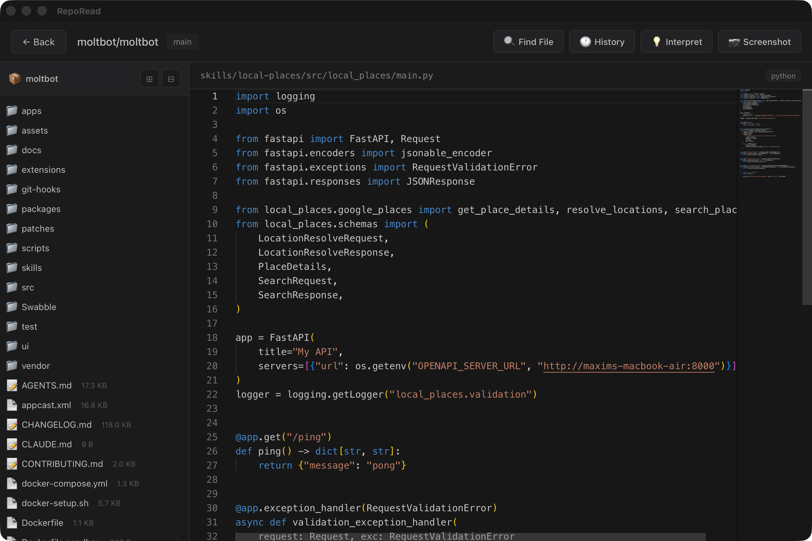
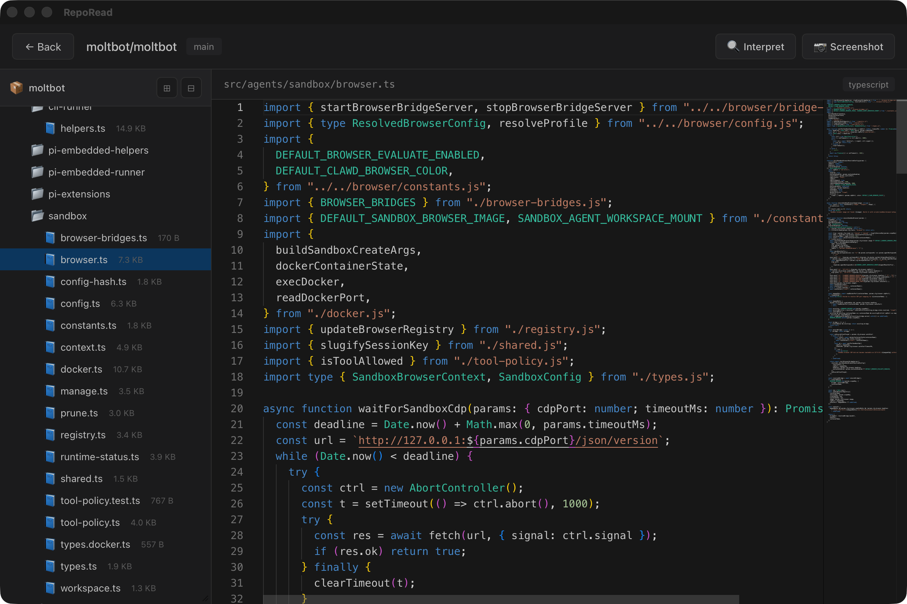

# RepoRead

<p align="center">
  
</p>

<p align="center">
  <strong>Read GitHub repositories. No clone. No setup. Just code.</strong>
</p>

<p align="center">
  <a href="#features">Features</a> •
  <a href="#installation">Installation</a> •
  <a href="#development">Development</a> •
  <a href="#license">License</a>
</p>

---

A lightweight desktop app for browsing GitHub repositories without cloning. Perfect for code review, learning from open source projects, or quickly exploring unfamiliar codebases.

## Features

- **Instant Access** - Enter a GitHub URL and start reading immediately
- **File Tree Navigation** - Browse repository structure with familiar folder/file hierarchy
- **Syntax Highlighting** - Monaco Editor (VS Code's editor) with full syntax highlighting
- **Search GitHub** - Search and import repositories directly from the app
- **Trending Repos** - Discover trending repositories by language and time period
- **Favorites** - Save repositories for quick access later
- **Screenshots** - Capture code regions as images (with clipboard support)
- **AI Interpretation** - Get AI-powered code explanations via OpenRouter API
- **Offline Cache** - Previously viewed repos are cached locally

## Screenshots

<p align="center">
  
  
</p>

## Installation

### macOS

Download the latest `.dmg` from [Releases](https://github.com/everettjf/RepoRead/releases) and drag to Applications.

### Homebrew (macOS)

```bash
brew tap everettjf/tap
brew install --cask reporead
```

### Build from Source

1) Install Rust (via rustup)
- macOS/Linux:
  ```bash
  curl --proto '=https' --tlsv1.2 -sSf https://sh.rustup.rs | sh
  source "$HOME/.cargo/env"
  ```
- Verify:
  ```bash
  rustc --version
  cargo --version
  ```

2) Install Bun
- macOS/Linux:
  ```bash
  curl -fsSL https://bun.sh/install | bash
  ```
- Verify:
  ```bash
  bun --version
  ```

3) Build and run RepoRead
```bash
# Clone the repository
git clone https://github.com/everettjf/RepoRead.git
cd RepoRead

# Install dependencies
bun install

# Run in development mode
bun run tauri dev

# Build for production (outputs .dmg to src-tauri/target/release/bundle/dmg/)
bun run tauri build
```

## Development

```bash
# Start development server
bun run tauri dev

# Build production app (outputs .dmg to src-tauri/target/release/bundle/dmg/)
bun run tauri build

# Frontend only (without Tauri)
bun run dev
```

### Tech Stack

- **Frontend**: React 19, TypeScript, Vite, Monaco Editor
- **Backend**: Rust, Tauri 2
- **Styling**: CSS (no framework)

### Project Structure

```
├── src/                  # React frontend
│   ├── components/       # React components
│   ├── api.ts           # Tauri IPC wrappers
│   └── types.ts         # TypeScript interfaces
├── src-tauri/           # Rust backend
│   └── src/
│       ├── lib.rs       # Tauri commands
│       └── repo.rs      # Core business logic
└── package.json
```

## Configuration

### GitHub Token (Optional)

For higher API rate limits, add your GitHub personal access token in Settings.

### AI Interpretation (Optional)

To enable AI-powered code interpretation:
1. Get an API key from [OpenRouter](https://openrouter.ai/)
2. Add the key in Settings > Interpretation

## License

MIT License - see [LICENSE](LICENSE) for details.

## Star History

[](https://star-history.com/#everettjf/RepoRead&Date)

---

<p align="center">
  Made with Tauri + React
</p>
